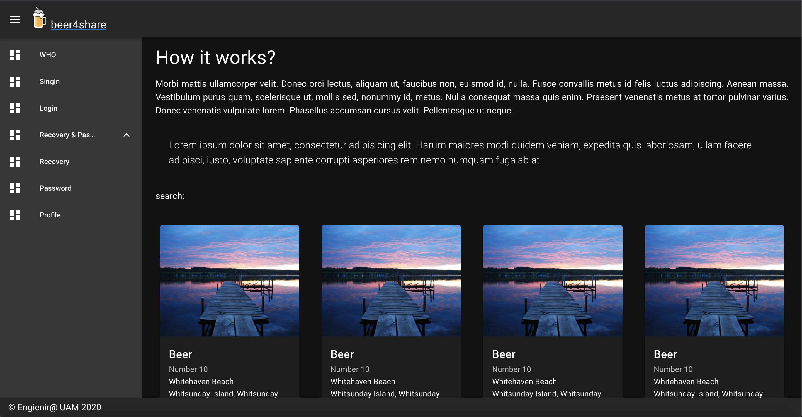

# Beer4Share

> This project is a schollar proposal. We are a small team of the Master in Computer Enginering of UAM (Universidad Autonoma de Madrid). And we are doveloping a system to share beers and brew receips using vue js and nuxt, you can see our initial  user interface propose here, this is simple prof of concept for the course of Advanced Intenet and Networks Master class:

https://www.figma.com/file/9s5V5ePkdSMK1TLdOaryzD/Web?node-id=0%3A1

We are using all serverless tools of firebase development environment.



## Build Setup

```bash
# install dependencies
$ npm install

# serve with hot reload at localhost:3000
$ npm run dev

# build for production and launch server
$ npm run build
$ npm run start

# generate static project
$ npm run generate
```

For detailed explanation on how things work, check out [Nuxt.js docs](https://nuxtjs.org).


